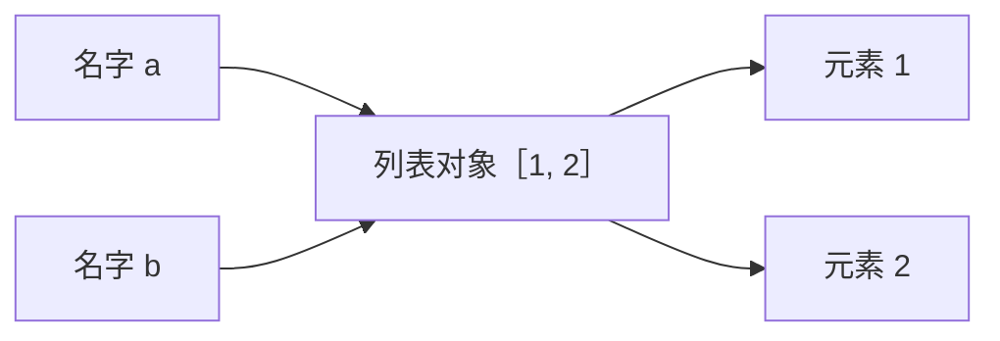
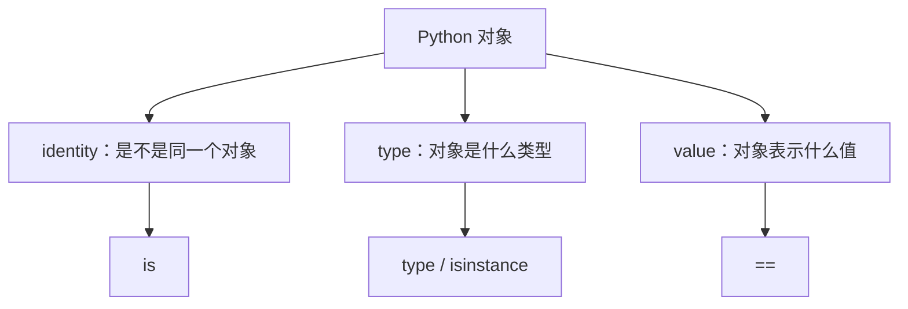
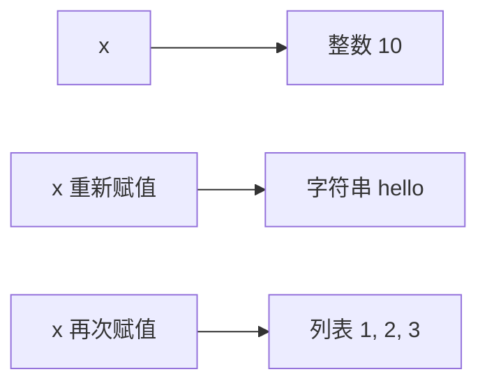

# 01. Python 基础与对象模型：图解与自测

对应正文：[01. Python 基础与对象模型](../docs/01-python基础与对象模型.md)

## 图解 1：变量不是盒子，而是名字与对象的绑定

当执行 `b = a` 时，没有复制列表，只是让 `b` 也指向同一个对象。因此 `b.append(3)` 后，`a` 看到的内容也变化。

## 图解 2：对象有 identity / type / value

## 图解 3：动态类型的本质是“名字可以重新绑定”

类型属于对象，不属于变量名本身。

---

# 章节自测

### 1. `a = [1, 2]`，然后执行 `b = a`。这一步有没有复制列表？

查看参考答案

没有。`a` 和 `b` 只是两个名字，二者引用同一个列表对象。只有显式执行浅拷贝、深拷贝或其他构造操作时，才可能创建新对象。

### 2. `==` 和 `is` 最准确的区别是什么？

查看参考答案

`==` 判断两个对象的值是否相等；`is` 判断两个表达式得到的是否是同一个对象，也就是对象身份是否相同。不要把 `is` 简单背成“比较内存地址”，因为“对象身份”是语言层面更准确的说法。

### 3. 为什么 `None` 推荐写成 `x is None`？

查看参考答案

`None` 是一个特殊的单例对象，我们要判断的是“这个对象是不是 None 本身”，因此使用身份判断 `is` 更准确，也符合 Python 社区惯例。

### 4. Python 是动态类型，是否意味着 Python 没有类型？

查看参考答案

不是。Python 中每个对象都有明确类型。所谓动态类型，是变量名不需要提前声明类型，并且运行时可以重新绑定到不同类型的对象。

### 5. 为什么说 Python 同时是“动态类型”和“强类型”？

查看参考答案

动态类型描述“变量名和类型的关系”：变量不需要提前声明类型。强类型描述“不同类型之间是否会被随意隐式混用”：例如字符串和整数不能直接相加，`"1" + 1` 会报 `TypeError`。

### 6. `if not items:` 为什么可以判断空列表？

查看参考答案

Python 会对对象进行真值判断。空列表、空字典、空集合、空字符串、0、`None`、`False` 等都被视为假值，所以空列表放在 `if` 中会得到 False。

### 7. `a, b = b, a` 为什么能交换变量？

查看参考答案

右侧会先形成待赋给左侧的一组结果，再进行解包绑定，因此不需要手动创建临时变量。面试基础层面理解为“先计算右侧，再解包到左侧”即可。

