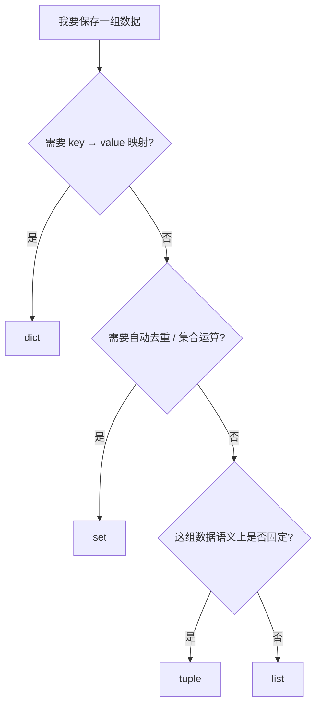

# 02. 核心数据类型与容器：图解与自测

对应正文：[02. 核心数据类型与容器](../docs/02-核心数据类型与容器.md)

## 图解 1：容器怎么选



这不是绝对规则，但非常适合面试时快速解释“为什么选这种结构”。

## 图解 2：list / tuple / set / dict 一眼对比

| 类型 | 有序 | 可变 | 重复 | 典型查找 | 常见用途 |
|---|---|---|---|---|---|
| list | ✅ | ✅ | ✅ | `x in list` O(n) | 动态序列 |
| tuple | ✅ | ❌ | ✅ | `x in tuple` O(n) | 固定记录 |
| set | 不应依赖顺序 | ✅ | ❌ | 平均 O(1) | 去重、集合运算 |
| dict | 保留插入顺序 | ✅ | key 不重复 | 按 key 平均 O(1) | 映射 |

## 图解 3：append 与 extend

```mermaid
flowchart LR
    A[[1,2]] -- append [3,4] --> B[[1,2,[3,4]]]
    C[[1,2]] -- extend [3,4] --> D[[1,2,3,4]]
```

---

# 章节自测

### 1. list 和 tuple 最核心的区别是什么？

<details><summary>查看参考答案</summary>

list 可变，元素可以增删改；tuple 本身不可变，创建后不能替换其中保存的元素引用。两者都支持有序存储、索引、切片和重复元素。

</details>

### 2. 为什么 `([1, 2], 3)` 这个 tuple 里的列表还能 append？

<details><summary>查看参考答案</summary>

因为 tuple 的“不可变”是指 tuple 自己保存的元素引用不能被替换，并不代表它引用的对象都必须不可变。`t[0]` 仍然指向同一个 list，而 list 自身可以被原地修改。

</details>

### 3. tuple 一定能作为 dict key 吗？

<details><summary>查看参考答案</summary>

不一定。dict key 必须可哈希。只有 tuple 的所有成员本身都可哈希时，这个 tuple 才可哈希。例如 `(1, "a")` 可以，而 `([1, 2], 3)` 不可以。

</details>

### 4. `set` 去重后为什么不建议直接说“还能保持原顺序”？

<details><summary>查看参考答案</summary>

set 的遍历顺序不应被业务逻辑依赖。`list(set(data))` 可以去重，但不能作为“保序去重”的可靠写法。需要保序时可以使用 `list(dict.fromkeys(data))`。

</details>

### 5. `remove()` 和 `discard()` 在 set 中有什么区别？

<details><summary>查看参考答案</summary>

两者都删除指定元素；如果元素不存在，`remove()` 会抛 `KeyError`，`discard()` 不会报错。

</details>

### 6. 字典如何按 key 排序？按 value 呢？

<details><summary>查看参考答案</summary>

按 key：`sorted(d.items())`。按 value：`sorted(d.items(), key=lambda item: item[1])`。`sorted()` 返回新的 list，不会原地重排原 dict。

</details>

### 7. 如何判断列表是否存在重复元素？

<details><summary>查看参考答案</summary>

如果元素都可哈希，可以比较长度：`len(lst) != len(set(lst))`。如果集合长度变短，说明有重复。若元素不可哈希，则需要其他策略。

</details>

### 8. 为什么 dict / set 查找平均很快？

<details><summary>查看参考答案</summary>

因为它们通常基于哈希表实现，通过对象的哈希值快速定位候选位置，所以平均查找、插入、删除可以接近 O(1)。这是平均情况，不代表最坏情况永远是 O(1)。

</details>
