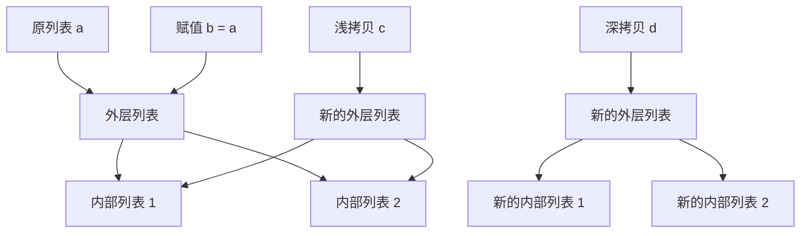
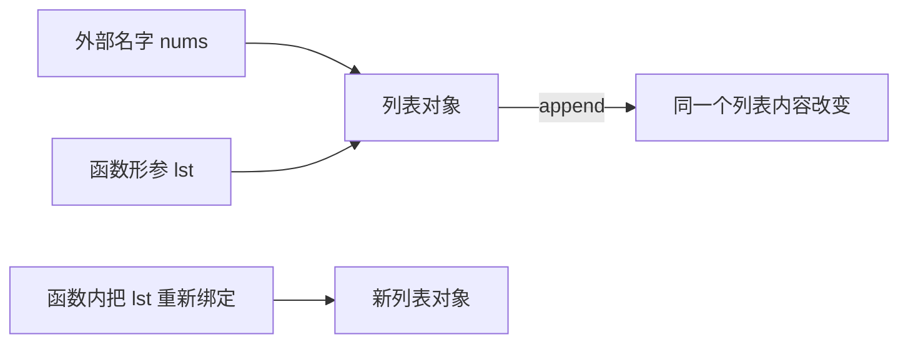

# 03. 可变对象、对象身份与深浅拷贝：图解与自测

对应正文：[03. 可变对象、对象身份与深浅拷贝](../docs/03-可变对象-对象身份-深浅拷贝.md)

## 图解 1：赋值、浅拷贝、深拷贝到底差在哪



最需要记住的是：**浅拷贝只保证最外层是新对象，内部引用仍可能共享。**

## 图解 2：函数参数是“共享对象引用”



原地修改共享对象会被外部看到；仅仅给形参重新赋值，只改变函数内部的绑定。

---

# 章节自测

### 1. `a = b`、浅拷贝、深拷贝分别会不会创建新的最外层对象？

<details><summary>查看参考答案</summary>

`a = b` 不会创建新对象；浅拷贝会创建新的最外层对象；深拷贝也会创建新的最外层对象，并递归复制需要复制的内部对象，使嵌套可变结构更独立。

</details>

### 2. 为什么修改浅拷贝的嵌套列表，原对象也可能变化？

<details><summary>查看参考答案</summary>

因为浅拷贝只复制了最外层容器。原对象和副本内部保存的，仍可能是指向同一个嵌套列表的引用，所以对该嵌套列表做原地修改时，两边都能看到。

</details>

### 3. 深拷贝是不是任何时候都比浅拷贝好？

<details><summary>查看参考答案</summary>

不是。深拷贝成本更高，复杂对象可能很大，而且某些资源对象并不适合复制。只有确实需要让复杂嵌套对象彼此独立时才应考虑深拷贝。

</details>

### 4. Python 的参数传递到底是值传递还是引用传递？

<details><summary>查看参考答案</summary>

面试中更准确的说法是“对象引用传递”或 call by sharing。形参与实参最初引用同一个对象。如果函数原地修改可变对象，外部可见；如果只是给形参重新绑定到新对象，则不会修改外部变量的绑定。

</details>

### 5. 为什么下面两次调用会共享列表？

```python
def add(x, items=[]):
    items.append(x)
    return items
```

<details><summary>查看参考答案</summary>

因为默认参数表达式在函数定义时求值一次，默认 list 只创建一次。后续没有显式传 `items` 的调用会复用这一个列表。通常应写成 `items=None`，再在函数内部创建新列表。

</details>

### 6. `del a` 是否等价于“销毁 a 指向的对象”？

<details><summary>查看参考答案</summary>

不等价。`del a` 删除的是名字 `a` 与对象之间的绑定。只要还有其他引用指向该对象，对象仍然存在。

</details>

### 7. 对不可变对象执行 `x += 1` 为什么常看到 `id(x)` 变化？

<details><summary>查看参考答案</summary>

因为整数等不可变对象不能原地修改。`x += 1` 通常会得到一个新的整数对象，再让名字 `x` 重新绑定到新对象。

</details>
