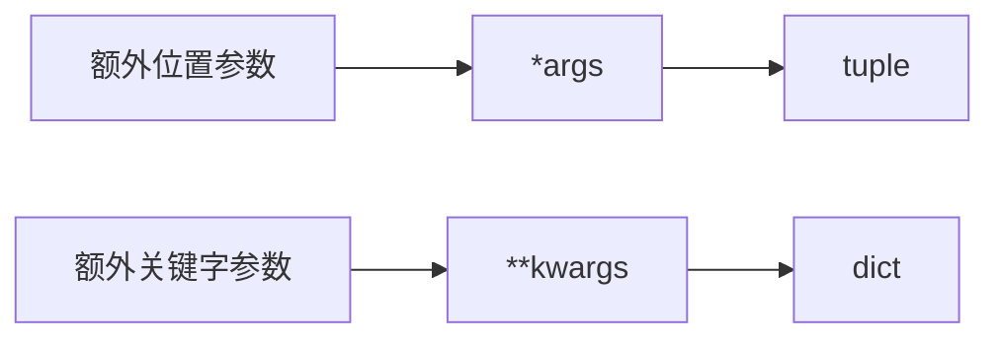
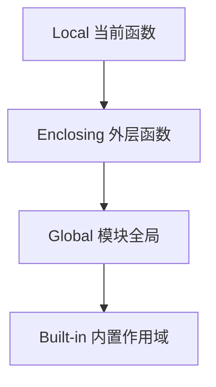

# 04. 函数、参数、作用域与闭包：图解与自测

对应正文：[04. 函数、参数、作用域与闭包](../docs/04-函数-参数-作用域-闭包.md)

## 图解 1：`*args` / `**kwargs` 是怎么收集参数的



定义函数时是“收集”，调用函数时 `*seq` / `**mapping` 是“展开”。

## 图解 2：LEGB 查找顺序



找到名字后就停止继续向外查找。

## 图解 3：闭包为什么能“记住变量”

```mermaid
flowchart LR
    OUTER[make_multiplier(2)] --> N[n = 2]
    OUTER --> INNER[multiply 函数]
    INNER -. 捕获外层变量 .-> N
    CALL[double(10)] --> INNER
    INNER --> RESULT[20]
```

---

# 章节自测

### 1. `*args` 和 `**kwargs` 分别是什么类型？

<details><summary>查看参考答案</summary>

`*args` 把额外位置参数收集成 tuple；`**kwargs` 把额外关键字参数收集成 dict。`args` 和 `kwargs` 只是约定俗成的名字，真正起语法作用的是 `*` 和 `**`。

</details>

### 2. 函数定义里的 `*` 和函数调用里的 `*` 是同一个意思吗？

<details><summary>查看参考答案</summary>

方向相反。定义时 `*args` 是收集多个位置参数；调用时 `func(*seq)` 是把序列或其他可迭代对象展开成位置参数。`**` 对关键字参数也是同理：定义时收集，调用时展开映射。

</details>

### 3. `global` 和 `nonlocal` 的区别是什么？

<details><summary>查看参考答案</summary>

`global` 声明当前函数里要重新绑定的是模块级全局名字；`nonlocal` 声明要重新绑定的是最近的外层函数作用域中的名字，不会指向模块全局作用域。

</details>

### 4. 什么是闭包？

<details><summary>查看参考答案</summary>

闭包通常指内部函数捕获了其外层函数作用域中的变量，即使外层函数已经返回，这个内部函数仍然能访问被捕获的变量。常见用途有保存状态、函数工厂和装饰器。

</details>

### 5. 为什么循环里创建的 `lambda: i` 常常最后都得到同一个值？

<details><summary>查看参考答案</summary>

因为闭包通常在调用时查找自由变量的当前值，存在晚绑定现象。循环结束后 `i` 已经是最终值，所以多个 lambda 看起来都返回同一个结果。可以用 `lambda i=i: i` 通过默认参数在定义时捕获当前值。

</details>

### 6. 为什么默认参数里的 `[]` 容易出问题，而 `None` 通常安全？

<details><summary>查看参考答案</summary>

默认参数在函数定义时只求值一次。可变 list 会被多次调用共享；`None` 是不可变单例，函数内部检测 `is None` 后再新建列表，就能保证每次需要默认容器时创建独立对象。

</details>

### 7. Python 函数“返回多个值”本质上发生了什么？

<details><summary>查看参考答案</summary>

`return a, b` 通常等价于返回一个 tuple `(a, b)`。调用方可以通过 `x, y = func()` 使用序列解包把 tuple 中的值绑定到多个名字。

</details>
