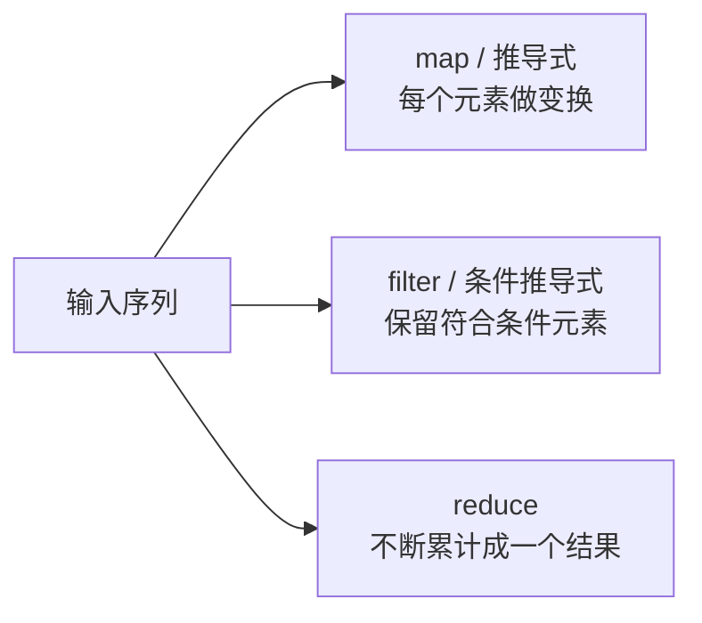
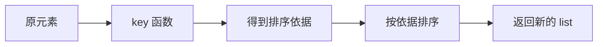

# 05. Lambda、推导式与常用内置函数：图解与自测

对应正文：[05. Lambda、推导式与常用内置函数](../docs/05-lambda-推导式-常用内置函数.md)

## 图解 1：映射、筛选、累计

## 图解 2：`sorted` 的 key 到底做什么

例如 `sorted(users, key=lambda x: x["age"])` 并不是直接“比较字典”，而是先为每个用户提取 age 作为排序依据。

---

# 章节自测

### 1. lambda 适合什么场景？为什么不建议写复杂逻辑？

查看参考答案

lambda 适合短小、一次性的表达式函数，例如作为 `sorted` 的 key。它只能写一个表达式，而且复杂逻辑挤在一行会明显降低可读性，所以复杂函数更适合用 `def`。

### 2. `(x * x for x in range(10))` 是 tuple 吗？

查看参考答案

不是。这是生成器表达式，得到 generator。若需要 tuple，需要显式写 `tuple(x * x for x in range(10))`。

### 3. `sorted()` 和 `list.sort()` 的区别？

查看参考答案

`sorted()` 接收任意可迭代对象并返回新的 list；`list.sort()` 只用于 list，原地修改列表，并返回 `None`。

### 4. `zip(a, b, c)` 做什么？长度不同会怎样？

查看参考答案

它按位置把多个可迭代对象配对，产生 tuple。默认情况下，只迭代到最短输入结束。常见用途是并行遍历多个序列或把多个列组合成记录。

### 5. 如何删除字符串中所有空白片段？

查看参考答案

一种常见写法是 `"".join(s.split())`。`split()` 不传参数时会按连续空白切分，并忽略两端空白，然后再用空字符串拼接。

### 6. `map` / `filter` 和列表推导式如何选？

查看参考答案

都可以完成映射或筛选。列表推导式通常更直观；如果已经有现成函数可直接复用，`map` / `filter` 也很自然。现代 Python 的 `map` / `filter` 返回惰性迭代对象，而列表推导式会立即构造 list。

### 7. `reduce` 是做什么的？

查看参考答案

`reduce` 会把序列元素按二元函数不断累计，最终得到一个结果。例如累乘 `[1,2,3,4]` 得到 24。若有 `sum`、`max` 等更直观的内置函数，通常优先使用可读性更好的表达方式。

### 8. 如何按字典 value 排序？

查看参考答案

可以写 `sorted(d.items(), key=lambda item: item[1])`。返回值是 `(key, value)` tuple 组成的新 list。

