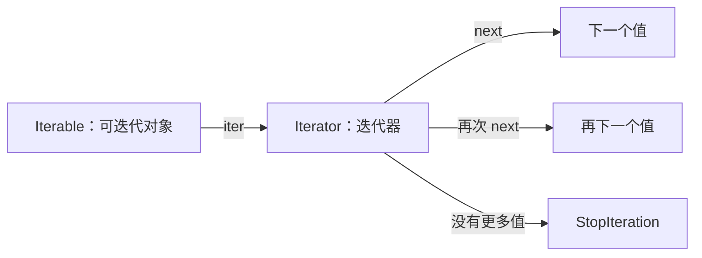
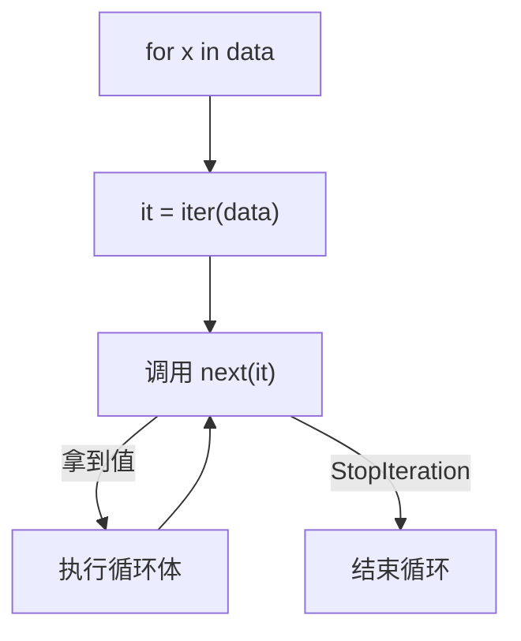
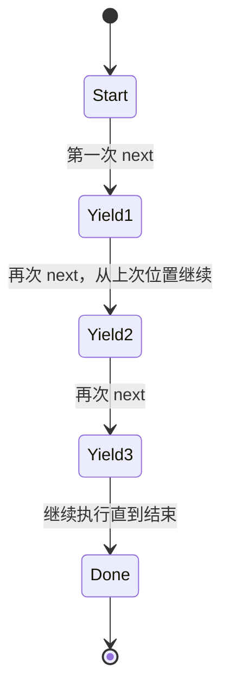

# 06. 迭代器、生成器与 yield：图解与自测

对应正文：[06. 迭代器、生成器与 yield](../docs/06-迭代器-生成器-yield.md)

## 图解 1：Iterable → Iterator → next

## 图解 2：for 循环的核心过程

## 图解 3：yield 是“暂停并保存现场”

---

# 章节自测

### 1. list 是 Iterator 吗？

查看参考答案

通常不是。list 是 Iterable，可以通过 `iter(list)` 得到一个 Iterator，但不能直接对 list 调用 `next(list)`。迭代器则保存当前遍历位置，并支持 `next()`。

### 2. 一个 Iterator 的 `__iter__()` 通常返回什么？

查看参考答案

通常返回它自己。因此 `iter(iterator) is iterator` 往往为 True。这样迭代器本身也满足可迭代协议。

### 3. 生成器和迭代器是什么关系？

查看参考答案

生成器是迭代器的一种。通过生成器函数或生成器表达式创建，自动实现迭代协议，不需要手写 `__iter__` 和 `__next__`。

### 4. `yield` 和 `return` 最大区别是什么？

查看参考答案

`return` 结束普通函数并返回结果；`yield` 产生一个值后暂停生成器函数，并保存当前执行状态。下一次取值时会从上次暂停位置继续，而不是从函数开头重新执行。

### 5. 为什么生成器通常省内存？

查看参考答案

因为它按需生成值，而不是先把所有结果构造成完整容器。这种惰性求值很适合大文件、数据流和很长甚至无限的序列。

### 6. 为什么 `list(g)` 调用一次后，再次 `list(g)` 常得到空列表？

查看参考答案

因为生成器保存遍历状态，第一次已经消费到末尾。生成器通常不能像 list 那样自动重新开始；若需要再次遍历，应重新创建生成器。

### 7. `for` 循环为什么不用你自己捕获 `StopIteration`？

查看参考答案

`for` 语句内部已经帮你完成了：先 `iter()`，再重复调用 `next()`，当捕获到 `StopIteration` 时自动结束循环。

