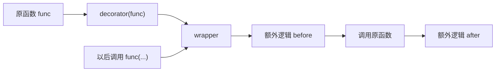
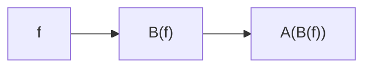
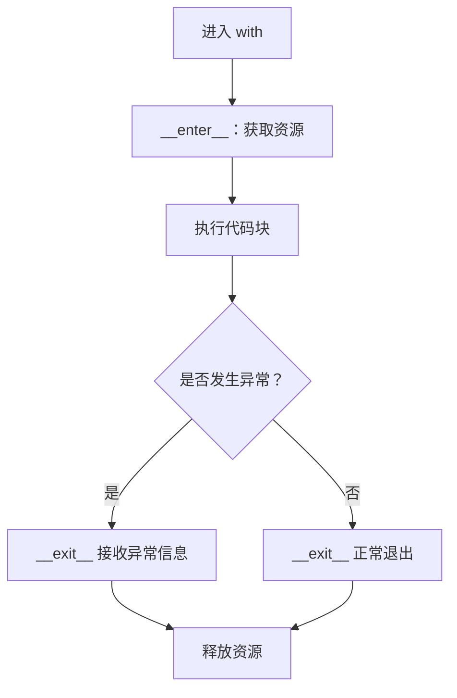

# 07. 装饰器与上下文管理器：图解与自测

对应正文：[07. 装饰器与上下文管理器](../docs/07-装饰器-上下文管理器.md)

## 图解 1：装饰器到底包了什么



`@decorator` 可以近似理解成 `func = decorator(func)`。

## 图解 2：多个装饰器



因此：

```python
@A
@B
def f():
    ...
```

是先由 B 包住 f，再由 A 包住 B 的结果。

## 图解 3：with 的资源生命周期



---

# 章节自测

### 1. 装饰器的本质是什么？

<details><summary>查看参考答案</summary>

装饰器本质上是一个接收函数或类，并返回新的可调用对象或类的对象。它利用“函数是一等对象”这一特点，在不修改原函数主体的情况下增加日志、缓存、权限、计时等行为。

</details>

### 2. 为什么通用 wrapper 通常写 `*args, **kwargs`？

<details><summary>查看参考答案</summary>

因为被装饰函数可能有任意位置参数和关键字参数。wrapper 用 `*args, **kwargs` 收集后再传给原函数，才能适配更广泛的函数签名。

</details>

### 3. `functools.wraps` 有什么作用？

<details><summary>查看参考答案</summary>

它用于把原函数的 `__name__`、`__doc__` 等元信息尽量复制到 wrapper 上，避免装饰后工具、调试信息和文档看到的都变成 wrapper。

</details>

### 4. `@A @B` 的包装顺序怎么记？

<details><summary>查看参考答案</summary>

`@A` 在上、`@B` 在下时，等价于 `f = A(B(f))`。也就是靠近函数的 B 先完成包装，外层 A 再包住 B 的结果。

</details>

### 5. 上下文管理器解决的核心问题是什么？

<details><summary>查看参考答案</summary>

它把“进入资源”和“退出/清理资源”的固定流程统一管理。即使代码块中发生异常，也能更可靠地执行清理逻辑，典型场景包括文件、锁、数据库连接和事务。

</details>

### 6. 自定义上下文管理器最核心的两个魔术方法是什么？

<details><summary>查看参考答案</summary>

`__enter__()` 和 `__exit__()`。进入 `with` 时调用 `__enter__`，退出时调用 `__exit__`。`__exit__` 还会接收到异常相关信息。

</details>

### 7. `@contextmanager` 中的 `yield` 前后通常分别做什么？

<details><summary>查看参考答案</summary>

`yield` 前通常负责获取/准备资源，`yield` 把资源交给 `with ... as ...` 使用，`yield` 后通常在 `finally` 中负责释放资源。

</details>
