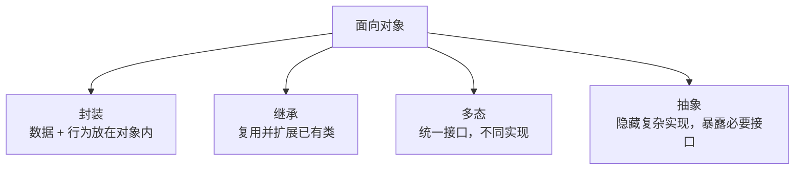
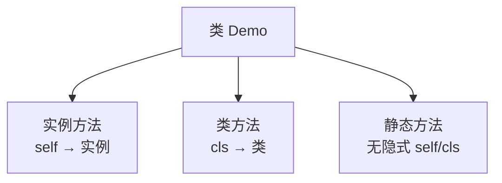

# 08. 面向对象与魔术方法：图解与自测

对应正文：[08. 面向对象与魔术方法](../docs/08-面向对象-魔术方法.md)

## 图解 1：面向对象四个核心思想



## 图解 2：实例创建过程

```mermaid
flowchart LR
    CALL[Person(...)] --> NEW[__new__<br/>创建并返回实例]
    NEW --> INIT[__init__<br/>初始化实例状态]
    INIT --> OBJ[可用实例]
```

## 图解 3：三种方法



---

# 章节自测

### 1. 类和对象分别是什么？

<details><summary>查看参考答案</summary>

类描述一类对象应该有哪些属性和行为，可以理解为“蓝图”；对象是按照类创建出来的具体实例，是实际存在并保存状态的实体。

</details>

### 2. “多态就是子类覆盖父类方法”这个说法完整吗？

<details><summary>查看参考答案</summary>

不完整。方法覆盖只是实现多态的一种方式。多态更核心的是：调用方使用统一接口，而不同类型对象根据自身实现表现出不同的行为。Python 还常通过鸭子类型实现多态，不一定要求显式继承同一个父类。

</details>

### 3. 实例方法、类方法、静态方法怎么区分？

<details><summary>查看参考答案</summary>

实例方法第一个参数通常是 `self`，适合操作实例状态；类方法用 `@classmethod`，第一个参数是 `cls`，适合操作类状态或做替代构造器；静态方法用 `@staticmethod`，没有隐式 `self/cls`，更像放在类命名空间里的普通函数。

</details>

### 4. `__new__` 和 `__init__` 的区别？

<details><summary>查看参考答案</summary>

`__new__` 负责创建实例并返回实例；`__init__` 接收已经创建好的实例并初始化其属性。大多数普通类只需要重写 `__init__`。

</details>

### 5. `__slots__` 的主要作用是什么？

<details><summary>查看参考答案</summary>

它用于声明实例允许使用的一组属性，并在某些大量实例场景下减少属性存储开销。不要绝对地说“用了 slots 就一定没有 `__dict__`”，继承结构等因素会影响结果。

</details>

### 6. `__str__` 和 `__repr__` 有什么区别？

<details><summary>查看参考答案</summary>

`__str__` 更偏向给用户看的友好字符串；`__repr__` 更偏向开发、调试，希望尽量明确、无歧义。`repr(obj)` 会优先调用 `__repr__`。

</details>

### 7. `_name` 和 `__name` 都是真正不可访问的私有属性吗？

<details><summary>查看参考答案</summary>

不是。单下划线 `_name` 主要是社区约定，表示内部使用；双下划线 `__name` 会触发名称改写，主要用于降低继承中的命名冲突，不是绝对的安全访问控制。

</details>

### 8. 面向过程和面向对象的区别如何面试表达？

<details><summary>查看参考答案</summary>

面向过程更关注“事情按什么步骤完成”，把问题拆成函数和流程；面向对象更关注“由哪些对象承担职责”，把数据和相关行为组织在对象内部。真实项目通常会混合使用，而不是非此即彼。

</details>
