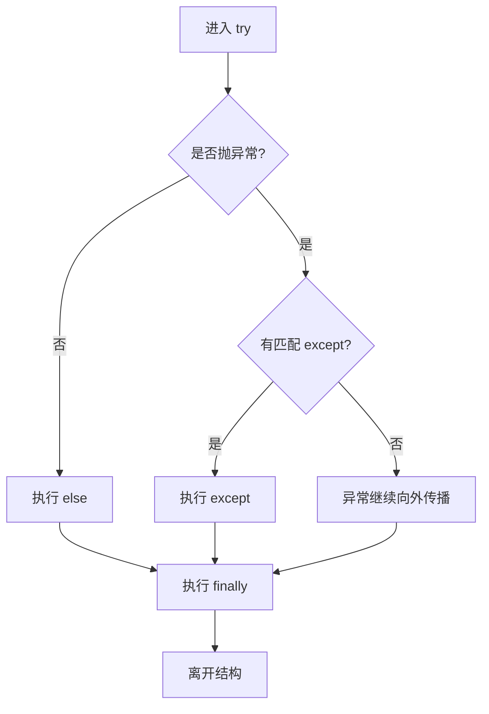
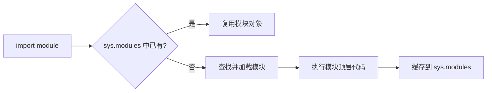

# 09. 异常、文件、模块与导入：图解与自测

对应正文：[09. 异常、文件、模块与导入](../docs/09-异常-文件-模块与导入.md)

## 图解 1：try / except / else / finally 流程

## 图解 2：with 管理文件

## 图解 3：import 的基本过程

---

# 章节自测

### 1. `else` 在异常处理结构中什么时候执行？

查看参考答案

当 `try` 代码块正常完成、没有抛出异常时执行。把“只有成功时才做的后续逻辑”放在 `else` 中，可以避免把太多无关代码塞进 `try`。

### 2. `finally` 的典型用途是什么？

查看参考答案

无论正常返回还是出现异常，通常都会进入 `finally`，所以它常用于释放资源、关闭连接、恢复状态等清理操作。但进程被强制终止、解释器崩溃、断电等极端情况不能保证执行。

### 3. 为什么不推荐裸 `except:`？

查看参考答案

因为它可能把原本不应该吞掉的异常也捕获掉，导致错误被隐藏、调试困难。更推荐捕获明确的异常类型，并只处理自己真正知道如何处理的问题。

### 4. `assert` 适合做用户输入校验或安全校验吗？

查看参考答案

不适合。`assert` 主要用于开发阶段检查程序内部假设，而且 Python 优化模式可以移除断言。关键业务校验应该显式判断并 `raise` 合适的异常。

### 5. 为什么读写文件推荐 `with open(...)`？

查看参考答案

因为文件对象实现了上下文管理协议，退出 `with` 时会更可靠地关闭文件，即使代码块中发生异常，也能执行清理逻辑。

### 6. 如何删除文件？

查看参考答案

常见方式有 `os.remove(path)`；现代代码也常用 `Path(path).unlink()`。实际项目还要考虑文件是否存在、权限、异常处理等。

### 7. Python import 的推荐分组顺序是什么？

查看参考答案

通常分为三组：标准库、第三方库、本地项目模块，组之间空一行。例如先 `os/sys`，再 `numpy/pandas`，最后导入自己项目里的模块。

### 8. `if __name__ == "__main__":` 解决什么问题？

查看参考答案

它用于区分“这个文件被直接执行”还是“作为模块被别人导入”。直接运行时 `__name__` 通常是 `"__main__"`；被导入时则是模块名。

### 9. 为什么重复 import 一个模块通常不会重复执行全部顶层代码？

查看参考答案

因为成功导入的模块通常会缓存在 `sys.modules`。之后再次 import 时一般复用已有模块对象，而不是每次都从头加载执行。

