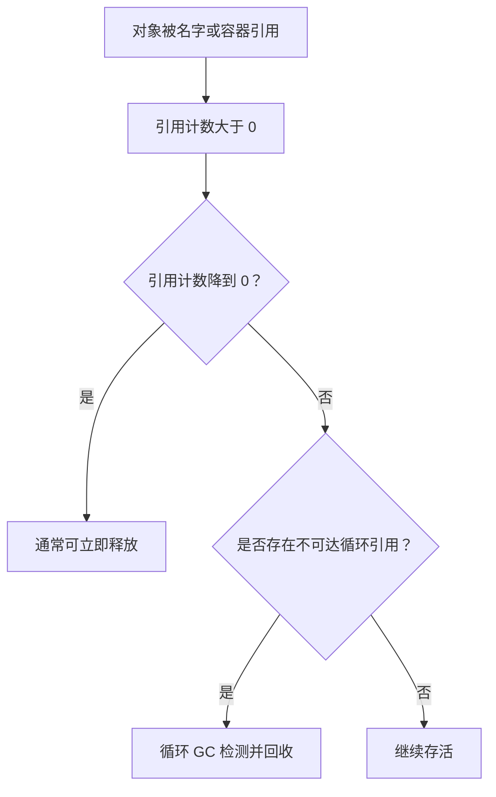
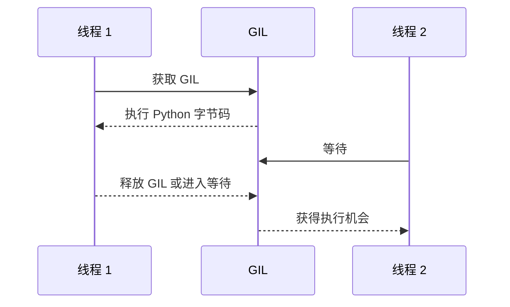
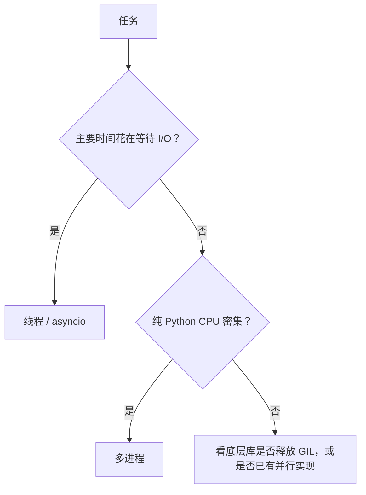

# 10. 内存管理、垃圾回收与 GIL：图解与自测

对应正文：[10. 内存管理、垃圾回收与 GIL](../docs/10-内存管理-垃圾回收-GIL.md)

## 图解 1：引用计数 + 循环垃圾回收

## 图解 2：为什么循环引用不能只靠引用计数

外部已经无法访问这两个对象，但它们仍互相引用，因此引用计数未必会自然变成 0。

## 图解 3：传统 CPython 中 GIL 对线程的影响

## 图解 4：任务类型怎么选

---

# 章节自测

### 1. `del a` 是否会强制销毁对象？

查看参考答案

不会。`del a` 删除的是名字 `a` 与对象之间的绑定。如果还有其他名字、容器或对象引用它，对象依然存在。

### 2. CPython 的垃圾回收机制只靠引用计数吗？

查看参考答案

不是。CPython 主要依赖引用计数管理对象生命周期，同时配合循环垃圾回收机制处理容器对象之间的循环引用问题。

### 3. GIL 最准确的面试描述是什么？

查看参考答案

在传统带 GIL 的 CPython 中，同一时刻一个解释器进程通常只有一个线程持有 GIL 并执行 Python 字节码。它简化了 CPython 内部对象和内存管理的同步，但会限制纯 Python CPU 密集型多线程的并行能力。

### 4. 为什么“Python 不是线程安全的，所以需要 GIL”这个说法太粗？

查看参考答案

因为 GIL 是 CPython 解释器内部实现机制，历史上与引用计数、对象模型和解释器共享状态的同步复杂度紧密相关。它不是简单由一句“Python 不线程安全”就能完整解释，也不是 Python 语言规范强制要求所有实现都必须有。

### 5. 有 GIL 为什么多线程做网络请求仍然有用？

查看参考答案

网络请求大量时间处于 I/O 等待。一个线程等待时，其他线程可以获得执行机会，因此线程可以让多个 I/O 任务交替推进，提高整体吞吐。GIL 主要限制的是多个线程同时执行纯 Python CPU 字节码。

### 6. CPU 密集任务如何规避传统 GIL 的限制？

查看参考答案

常见方法包括使用 `multiprocessing` / 进程池，让不同进程拥有独立解释器；或者把计算交给会释放 GIL 的 C/C++ 扩展、NumPy 等底层库。具体效果取决于库实现。

### 7. “有 GIL，所以整个 Python 进程只能使用一个 CPU 核”对吗？

查看参考答案

不对。底层扩展可能释放 GIL 并使用多线程并行，多个进程也能使用多个核。更准确地说，传统 GIL 会限制同一解释器中多个线程同时执行纯 Python 字节码。

### 8. GIL 是否意味着业务代码自动线程安全？

查看参考答案

不意味着。业务逻辑通常包含多步骤读写，共享状态仍可能出现竞态；某些库也会释放 GIL。需要时仍应使用锁、队列、不可变数据或其他同步机制。

