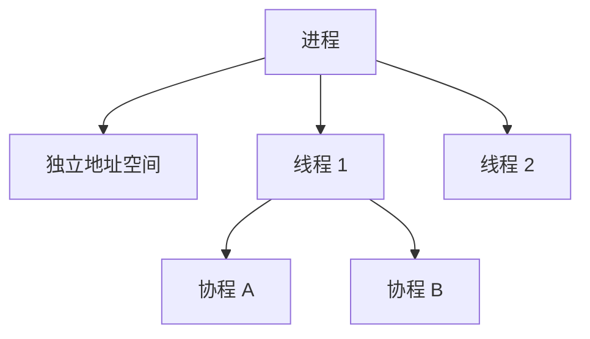
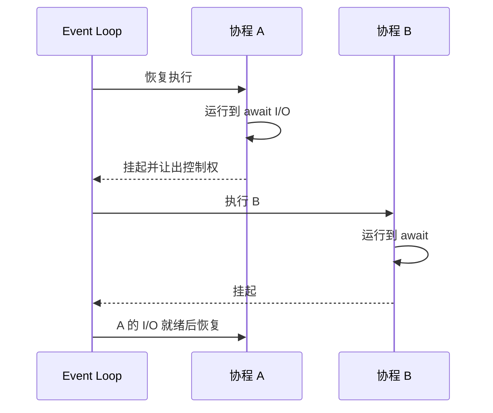
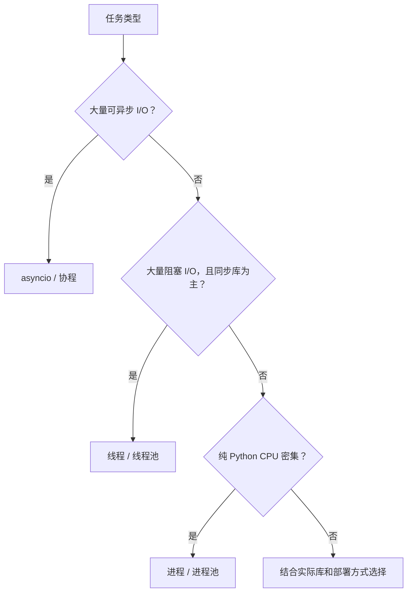

# 11. 线程、进程、协程与 async/await：图解与自测

对应正文：[11. 线程、进程、协程与 async/await](../docs/11-线程-进程-协程-async-await.md)

## 图解 1：进程 / 线程 / 协程

这里主要表达“层级关系”：进程拥有资源，线程运行在进程内，协程通常由用户态运行时/事件循环调度。

## 图解 2：asyncio 事件循环

## 图解 3：怎么选并发模型

---

# 章节自测

### 1. 进程和线程最核心的区别是什么？

查看参考答案

进程通常拥有独立地址空间，隔离性更强；同一进程中的线程共享大部分进程内存，通信更方便但也更容易出现共享状态竞态。进程创建和通信成本通常更高。

### 2. 为什么线程适合 I/O 密集任务？

查看参考答案

I/O 任务经常在等待网络、磁盘、数据库等。当一个线程阻塞等待时，其他线程可以继续推进工作，因此能提高并发吞吐。

### 3. 协程和线程最大的调度差异是什么？

查看参考答案

线程通常由操作系统调度；协程通常由用户态事件循环调度，并在 `await` 等可挂起点主动让出控制权。协程切换通常更轻量，但要求任务和库支持非阻塞/异步模式。

### 4. `async def` 调用后是否立即像普通函数一样执行完？

查看参考答案

通常不会。调用协程函数会得到协程对象，需要被 `await`、创建为任务，或由 `asyncio.run()` 等机制放入事件循环中驱动执行。

### 5. `await` 是不是“新建线程”？

查看参考答案

不是。`await` 表示当前协程等待一个 awaitable，并允许在等待期间把控制权交回事件循环，让其他可运行协程继续执行。它本身不会创建线程。

### 6. 为什么 `await task1(); await task2()` 不一定并发？

查看参考答案

因为第一句会先等待 task1 完成，之后才执行第二句。要让多个协程并发推进，通常需要先创建多个任务，或使用 `asyncio.gather(task1(), task2())` 等方式一起调度。

### 7. 为什么 CPU 密集循环会卡住 asyncio？

查看参考答案

事件循环依赖协程在 `await` 点让出控制权。一个长时间执行、没有 await 的 CPU 循环会一直占用执行线程，其他协程无法得到调度机会，因此会阻塞整个事件循环。

### 8. 有 GIL 为什么仍然需要 Lock？

查看参考答案

GIL 不是业务逻辑级别的事务锁。多个线程对共享状态进行多步骤读改写时仍可能交错执行，造成竞态，所以关键临界区仍可能需要 `Lock` 或其他同步机制。

### 9. `ThreadPoolExecutor` 和 `ProcessPoolExecutor` 常见使用场景？

查看参考答案

线程池常用于阻塞 I/O；进程池常用于传统 CPython 下的纯 Python CPU 密集计算。实际选择还要考虑数据传输成本、库是否释放 GIL、任务规模等。

