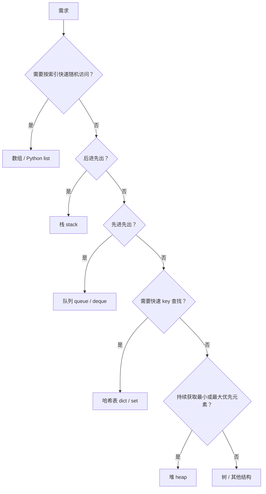
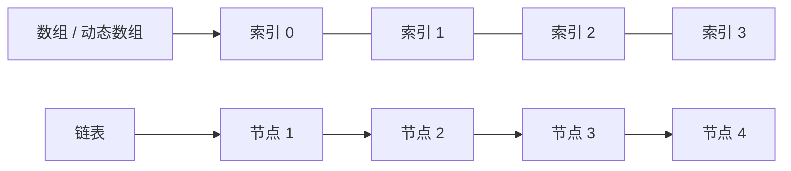
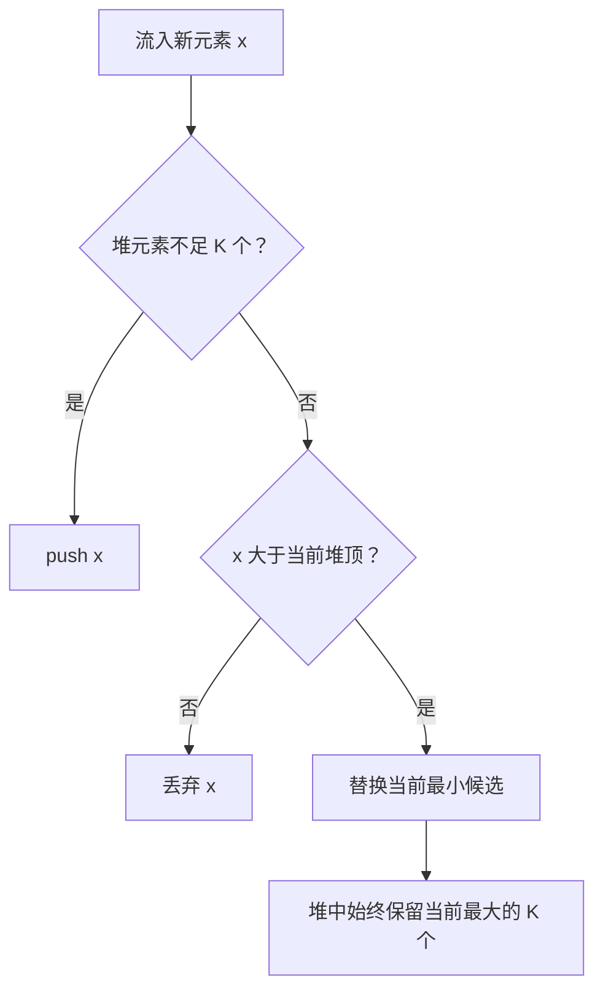

# 12. 常见数据结构与复杂度：图解与自测

对应正文：[12. 常见数据结构与复杂度](../docs/12-常见数据结构与复杂度.md)

## 图解 1：常见数据结构怎么选

## 图解 2：数组与链表

数组通过索引定位快；链表需要沿引用逐步查找，但已经定位节点后修改链接很方便。

## 图解 3：Top K 为什么用大小为 K 的最小堆

---

# 章节自测

### 1. 数组和链表的主要区别是什么？

查看参考答案

数组通常使用连续或紧凑的存储布局，支持 O(1) 随机索引访问；链表节点通过引用连接，随机访问需要顺序走节点，通常 O(n)。数组中间插删常需要搬移元素；链表在已经定位到节点并具备必要前驱信息时，修改链接本身可 O(1)。

### 2. 为什么说“链表删除是 O(1)”需要加条件？

查看参考答案

如果还要先从头查找待删除节点或它的前驱，查找过程可能 O(n)。只有已经拿到需要修改链接的位置时，删除动作本身才可以是 O(1)。

### 3. 栈和队列有什么区别？

查看参考答案

栈是 LIFO，后进先出，典型操作是栈顶 `push/pop`；队列是 FIFO，先进先出，通常队尾入队、队头出队。

### 4. Python 实现普通队列为什么常用 `collections.deque` 而不是 `list.pop(0)`？

查看参考答案

`list.pop(0)` 删除头元素后通常需要移动后续元素，时间复杂度 O(n)。`deque.popleft()` 为两端操作设计，通常可以 O(1) 从左端弹出。

### 5. “栈和堆有什么区别”为什么要先确认语境？

查看参考答案

因为“栈/堆”既可能指数据结构，也可能指程序运行时内存概念。数据结构里的 stack 是 LIFO，heap 是优先队列常用的完全二叉树结构；内存语境下的栈和堆含义完全不同。

### 6. Python `heapq` 默认是最大堆还是最小堆？

查看参考答案

默认是最小堆，`heap[0]` 是当前最小元素。push 和 pop 的典型复杂度为 O(log n)，查看 `heap[0]` 是 O(1)。

### 7. 一亿个数找最大的 100 个，为什么不需要全部排序？

查看参考答案

维护一个大小为 100 的最小堆即可。堆顶是当前 Top 100 中最小的数，新数只有大于堆顶时才需要进入候选。这样时间约 O(n log k)，空间 O(k)，k=100 时远小于保存和排序所有数据。

### 8. 如何判断 list 中有没有重复元素？

查看参考答案

元素都可哈希时，可以写 `len(lst) != len(set(lst))`。集合自动去重，因此长度变化说明原列表存在重复元素。

### 9. BFS 和 DFS 通常分别借助什么结构？

查看参考答案

BFS 一层一层扩展，通常使用队列；DFS 不断深入再回退，通常使用栈或递归调用栈。

### 10. O(1)、O(log n)、O(n)、O(n log n)、O(n²) 中，n 变大时谁增长得更快？

查看参考答案

大体从慢到快是：O(1) < O(log n) < O(n) < O(n log n) < O(n²)。复杂度表示增长趋势，不是精确的实际运行时间。

